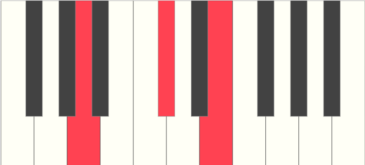
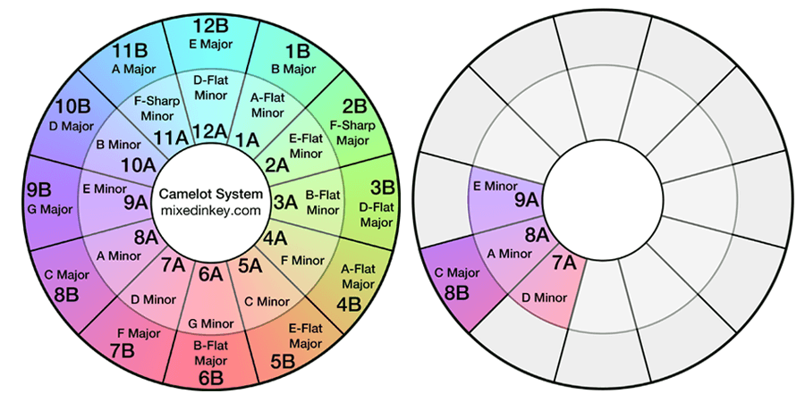
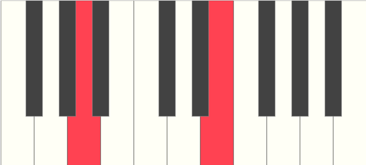
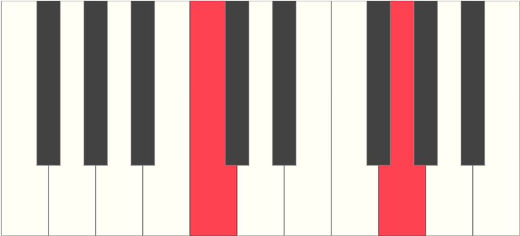
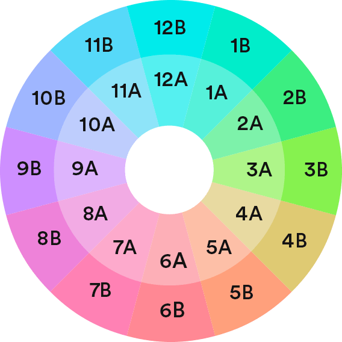

Mixed In Key is a software that DJs around the world use to create their live sets. It's a very useful tool that helps find the key and scale of a track along with the energy level. In this post I will go over what I learned from using this software.

## What is Harmonic Mixing?

As the website states is used for harmonic mixing. But what is harmonic mixing? Well it has something to do with music theory and a sound's harmonic series. I'll try and explain this using the `Amaj` chord.

The `Amaj` chord is made up of three keys, `A`, `C#`, and `E`. The fundamental frequency of that chord is the lowest frequency which is `A`. If you look at frequencies chart for piano notes you can see all the frequencies for each key. Let's use the `A` above middle `C` key because it has a easy frequency to remember 440 Hz.

There's something in music theory called `perfect interval`, these intervals are fourths, fifths, and octaves. It is all based off of their frequencies ratio compared to the fundamental frequency. For example a perfect octave has a ratio of 2:1, so a perfect octave for our fundamental frequency 400Hz is 880 Hz. That's the next `A` key on the piano keyboard! The math isn't important, but for the perfect fourth has a ratio of 4:3 and a perfect fifth has a ratio of 3:2.

If you look at the `Amaj` chord or `Amin` chord you will notice that the perfect fifth is `E` while our fundamental frequency is `A`. Based on the frequency ratio we know when we play `A` and `E` together it sounds good! What about the key between them? The third interval determines if the chord is major or minor.

Now that we know about perfect intervals. Let's quickly talk about a scale of a track. We know that minor scale creates mellow melodies and a major scale creates happy melodies, this is a very generalize way to describe minor and major scales. The most important takeway is a scale determines the notes played in the track.

Now harmonic mixing is based off of the perfect interval but focuses on the perfect fifth! What do you mean it's based off the perfect fifth? Let's take a look on how to use their Camelot Wheel.

Looking at the wheel, let's imagine we are playing a track that has a key of `A` and is in the `minor` scale as known as `Amin`. It states we could mix it with another track that is in `Emin`/Up, `Dmin`/Down, `Amin`/Same, or `Cmaj`/Same. What does Up, Down, and Same mean? Up means up a fifth, Down means down a fifth, and Same means same scale.

We know that every minor scale has a relative major scale and vice versa. In our case, `Amin` has a relative major scale `Cmaj`. Ok, now let's understand what up a fifth means, the wheel states we can go from `Amin` to `Emin`. Let's use the piano keyboard to visualize this.

We learned earlier that `E` was the perfect fifth of `A`! We know that the frequency ratio is 3:2 and the frequency are very similar. That means if we mix a track from `Amin` to `Emin`, people can barely tell the difference or that a change happened.

What's the biggest takeaway from this? As we move clockwise on the wheel we are going up a perfect fifth from the fundamental key. And we know that the perfect fifth for both minor and major scales is 7 keys up from the fundamental key.

Let's test this theory out using `C` as our fundamental key and the scale does not matter!

Remember, we are going up but what does that mean? Going up means we are counting the keys above our fundamental key, these keys has higher frequencies and a higher pitch. Now let's counting to 7 starting with key next to `C` which is the black key called `C#`. Counting all the keys until we hit 7, will be our perfect fifth! The perfect fifth for `C` is `G` and it matches with the wheel. Going clockwise we can see `Cmin` -> `Gmin` and `CMaj` -> `Gmin`.

Now we know what up a fifth means! Let's focus on what down a fifth means! But let's take some time to think about this! Going down a fifth is like the opposite of going up a fifth... In other words using keyboard above, down a fifth for `G` which was previous known as our perfect fifth but we are naming it our fundamental key is `C`. This matches what the wheel state going counter clockwise `Gmin` -> `Cmin` and `Gmaj` -> `Cmaj`.

Wait there's a pattern here! Going up a fifth means going up 7 keys and going down a fifth means going down 7 keys from the fundamental key. Are you telling me if I know how to count to 7 than I know how to mix my tracks? Yes! Good thing we have 10 fingers!

Let's understand how to use this chart without making me thinking about the number 7!

Looking this camelot wheel that determine what track I will play next. There is a `number` and a `letter` now. The number represent all possible keys on a piano and the letter represent if the scale is a minor `A` or major `B`. We know there are 12 possible piano keys before we start repeating the same keys.

Now how do we use this chart? The Mixed In Key software will find the key and scale of all your tracks and give it a number and letter. Now you can pick your next track based off it's number and letter.

Let's say we are playing a track that is label `1A` we have many options:

1. We can play another track that is `1A` and continue playing the same key and scale.
2. We can change the scale and play `1B` track and continue playing the same key but in a major scale.
3. We can go up a fifth and play `2A` track and play a different key but same scale.
4. We can go down a fifth and play `12A` track and play a different key but same scale.
5. many more options as you know it's based off of the perfect intervals.

Having these labels makes it easy for DJs to mix a track in without looking at the camelot chart or counting to 7!

## Energy Levels

Mixed In Key also determines the energy level of your track for you! We all know tracks emits different energy levels, some songs makes you sad, happy, want to dance, and wants to put your hands in the air! But how do we determine the energy level?

> Drums form the DNA strands of dance music

One good way is to determine what type of kick is used in the track. The kick guides everyone on the dance floor and knowing the shape of the kick we can determine the energy level. Mixed In Key does this all for us using a scale from 1 to 10!

### Energy Level 1, 2, 3, & 4

Are consider chillout and lounge music, it's hard to dance to them but can be played in restaurants.

### Energy Level 5

This is where people start dancing but are not the mainstream music you hear in clubs.

### Energy Level 6 & 7

At this level there's a lot of energy on the dance floor for people to start dancing.

### Energy 8 & 9

Play a song at this energy level will make people raise their hands in the air! Use this power wisely!

Energy Level 10 is never play because it's TOO LOUD!

Mixed In Key gives you all the tools DJs needs to create a live set. It's important to create an emotion roller coaster because that's what life is. It's just one big roller coaster ride!
