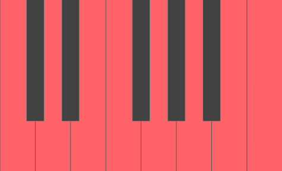
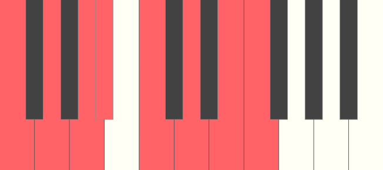
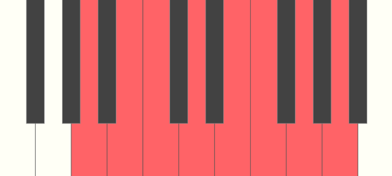

What is a musical scale and why is it important to know? A scale is eight successive pitches all within a one octave range. In other words, all scales starts on one note and ends on that same note one octave higher. Each scale is picked to convey an emotion to the listeners. One day I hope to understand each scale, but for now I'm still learning.

The best way to learn about scales is using the `C major` scale. All the notes in the scale is the white keys and it's a good one to remember when we think about a major scale.

I colored all the white keys a shade of red to represent the notes in a scale. In a `C major` scale the root is the `C` key and we end the scale on the same key but one octave higher. We use a number to represent the notes in the scale, this is known as degrees.

### Degrees of a Scale

| Degree          | Name         |
| --------------- | ------------ |
| First / Root    | Tonic        |
| Second          | Supertonic   |
| Third           | Mediant      |
| Fourth          | Subdominant  |
| Fifth           | Dominant     |
| Sixth           | Submediant   |
| Seventh         | Leading Note |
| Eighth / Octave | Tonic        |

As you can see there are seven unique notes in a scale before we hit tonic again! What makes each scale unique is the specific intervals between each degree in the scale. The `C major` scale is the best way to remember the intervals for all major scales! Each intervals between each degree can be described using whole and half steps.

### Major Scale

| Note    | Half Steps to Next Note |
| ------- | ----------------------- |
| Tonic   | 2                       |
| Second  | 2                       |
| Third   | 1                       |
| Fourth  | 2                       |
| Fifth   | 2                       |
| Sixth   | 2                       |
| Seventh | 1                       |

Now that we know the intervals for a major scale we can apply this to any key on the piano. It's do the `F` major scale!

Now let's do the minor scale! But wait there's three different minor scales to pick from!

### Types Of Minor Scale

- natural
- harmonic
- melodic

Let's do the natural minor scale first and the easiest way to remember this scale is using the `A minor` scale.

Looking at the `A minor` scale we can see all the notes in the scale are the white keys just like `C major`. The reason why is because they are relative to each other where all the notes are the same in both scale. The only difference is the tonic!

The trick to finding the relative scale of major or minor is first knowing what scale you are in.

If you are in a major scale, the relative natural minor scale would be 9 half-steps up.

If you are in a natural minor scale, the relative major scale would be 3 half-steps up.

### Natural Minor Scale

| Note    | Half Steps to Next Note |
| ------- | ----------------------- |
| Tonic   | 2                       |
| Second  | 1                       |
| Third   | 2                       |
| Fourth  | 2                       |
| Fifth   | 1                       |
| Sixth   | 2                       |
| Seventh | 2                       |

Now for the harmonic minor, it's very similar to the natural minor except the seventh note is raised a half step.

### Harmonic Minor Scale

| Note    | Half Steps to Next Note |
| ------- | ----------------------- |
| Tonic   | 2                       |
| Second  | 1                       |
| Third   | 2                       |
| Fourth  | 2                       |
| Fifth   | 1                       |
| Sixth   | 3                       |
| Seventh | 1                       |

Now let's do the melodic minor, it's very similar to the natural minor except both the sixth and seventh notes are raised a half step.

### Melodic Minor Scale

| Note    | Half Steps to Next Note |
| ------- | ----------------------- |
| Tonic   | 2                       |
| Second  | 1                       |
| Third   | 2                       |
| Fourth  | 2                       |
| Fifth   | 2                       |
| Sixth   | 2                       |
| Seventh | 1                       |

Once you get past the major and minor scales, there are other combination of intervals in a scale. Since there are 7 degrees in a scale there are 7 different modes. You can think of this as starting on a different degree on the major scale.

### Ionian - starting on the tonic on a major scale

| Note    | Half Steps to Next Note |
| ------- | ----------------------- |
| Tonic   | 2                       |
| Second  | 2                       |
| Third   | 1                       |
| Fourth  | 2                       |
| Fifth   | 2                       |
| Sixth   | 2                       |
| Seventh | 1                       |

### Dorian - starting on the second degree on a major scale

| Note    | Half Steps to Next Note |
| ------- | ----------------------- |
| Tonic   | 2                       |
| Second  | 1                       |
| Third   | 2                       |
| Fourth  | 2                       |
| Fifth   | 2                       |
| Sixth   | 1                       |
| Seventh | 2                       |

### Phrygian - starting on the third degree on a major scale

| Note    | Half Steps to Next Note |
| ------- | ----------------------- |
| Tonic   | 1                       |
| Second  | 2                       |
| Third   | 2                       |
| Fourth  | 2                       |
| Fifth   | 1                       |
| Sixth   | 2                       |
| Seventh | 2                       |

### Lydian - starting on the fourth degree on a major scale

| Note    | Half Steps to Next Note |
| ------- | ----------------------- |
| Tonic   | 2                       |
| Second  | 2                       |
| Third   | 2                       |
| Fourth  | 1                       |
| Fifth   | 2                       |
| Sixth   | 2                       |
| Seventh | 1                       |

### Mixolydian - starting on the fifth degree on a major scale

| Note    | Half Steps to Next Note |
| ------- | ----------------------- |
| Tonic   | 2                       |
| Second  | 2                       |
| Third   | 1                       |
| Fourth  | 2                       |
| Fifth   | 2                       |
| Sixth   | 1                       |
| Seventh | 2                       |

### Aeolian - starting on the sixth degree on a major scale, known as natural minor scale

| Note    | Half Steps to Next Note |
| ------- | ----------------------- |
| Tonic   | 2                       |
| Second  | 1                       |
| Third   | 2                       |
| Fourth  | 2                       |
| Fifth   | 1                       |
| Sixth   | 2                       |
| Seventh | 2                       |

### Locrian - starting on the seventh degree on a major scale

| Note    | Half Steps to Next Note |
| ------- | ----------------------- |
| Tonic   | 1                       |
| Second  | 2                       |
| Third   | 2                       |
| Fourth  | 1                       |
| Fifth   | 2                       |
| Sixth   | 2                       |
| Seventh | 2                       |

When you pick a scale, most of the notes in the melody and chords should be within the scale.
